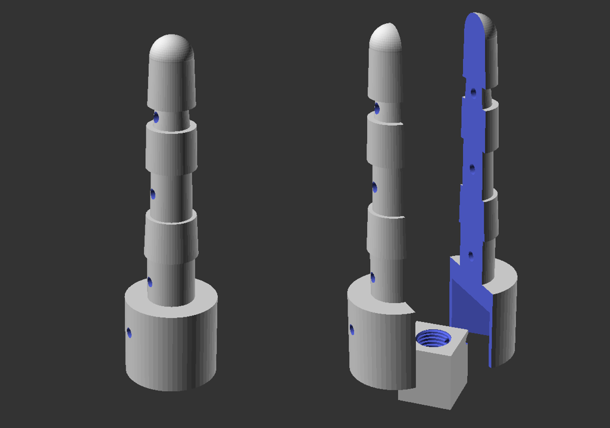
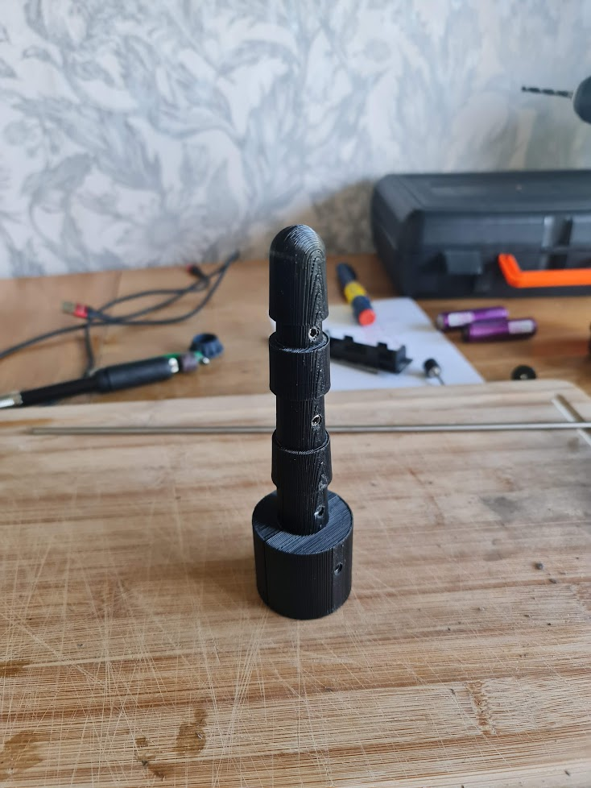
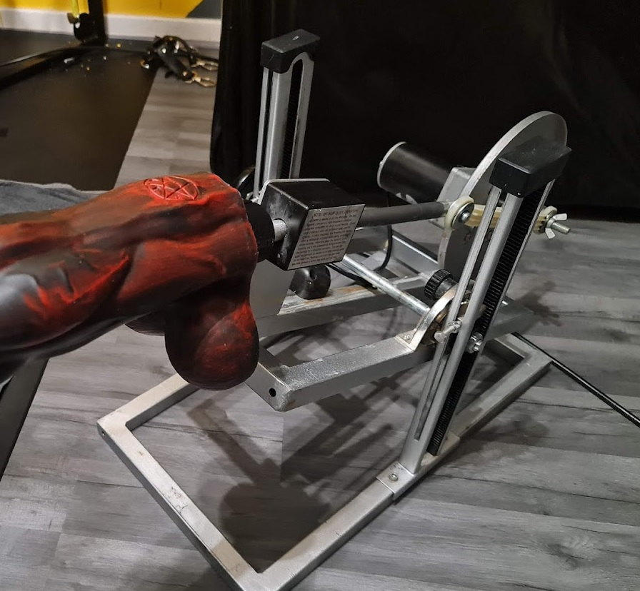

# Machine mounts for Twisted Beast toys
This repository contains files for you to 3D print adapters to use your Twisted Beast toys with your fucking machine.

This stuff is **in no way endorsed or connected with Twisted Beast** - everything here is provided under the MIT licence, which means you use it all at your own risk.

|   |   |   |
|---|---|---|
||||

## Progress
This table shows you which combination of 'size' and 'machine' can be printed:

| Machine | Small | Large |
| ---     |:---:  |:---:  |
| LoveBotz Maestro ||✔|

If you have any information on the threads used on other machines, let me know and I'll add a connector block!

## How to use
To print off your mount, you'll need:
 - A 3D printer
 - Filament (PLA is fine!)
 - Material for the pins to hold the whole thing together (I use 5mm steel tube, cut to length)

### Before you begin
The adapter is printed off in three parts - two halves of the 'stem' (the shaft which you insert into the toy) and a 'connector block' which slots into the bottom of the stem and is what attaches to your specific machine. The whole thing is held together with a set of pins which you push through holes in the stem.

It is really important that you print off the various bits in the correct orientation - 3D prints are typically weakest in the Z (up and down) direction, so you'll be printing the two halves of the stem flat against the bed - this ensures that your mount won't shear or snap where the stem meets the base.

The connector block is printed 'upright' as the threaded part needs to be as perfect as possible - it's a tradeoff between getting a good thread and strength.

**This way, if anything snaps, it'll be the connector block rather than the stem in your toy!**

You should use a strong material to make the locking pins - I use 5mm steel tube which I cut to length and round off the end edges to make inserting them easy. A blob of hot glue in each hole prevents the pins from coming out.

### Suggested Printer Settings
| Setting | Stem | Connector Block |
| --- | --- | --- |
| Layer Height | <= .3mm | <= .3mm |
| Top solid layers | 3 | all |
| Bottom solid layers | 3 | all |
| Shell perimiter layers | 2 | 2 |
| First Layer Height | 150% | 150% |
| First Layer Width | 150% | 150% |
| Infill %  | >= 30% | 100% |
| Infill Pattern | Rectilinear | Rectilinear |
| Infill Angles | 0, 45, 90, 135 | 0, 90 |
| Support | None | None |

### Let's go!
1. Grab the correct size .stl from the 'stems' folder
1. Print the two halves of the stem using a rotating rectilinear infill at 30%
1. Grab the correct connector block .stl from the 'connectors' folder
1. Print the connector block at 100% infill (print it upright!)
1. Cut your pins to the correct size (see the table below)
1. Place your connector block into the base of the stem and push the longest pin through the hole
1. Place the rest of the pins in to their holes
1. Attach the whole thing to your machine, then slot your toy on
1. Bugger yourself senseless

**Side holes too small for your pins?** You can drill the holes out a little - but not too much! The pin should fit snugly and not move around on it's own. Add a blob of glue to each end to make sure everything is held securely.

## Customising the mount
The mount is defined in an OpenSCAD file as a series of modules used to create the various parts of the mount. These all get combined together then the holes for the locking pins are 'drilled' through the final volume.

### Setting up your enviromment
You'll need to set up a few things to produce a custom .stl file:
1. Install OpenSCAD from [openscad.org](https://openscad.org)
1. Install the Belfry OpenScad Library (used for threads) from [their github repo](https://github.com/revarbat/BOSL#installation)
1. Open mount.scad from the 'openscad' folder in this repo

### Output Settings
Key settings are at the top of the file:

#### `render_for_print`
When `true`, selected components are laid out for printing. When `false`, components are assembled as a preview of the completed mount.

### `explosion_distance`
The amount to 'explode' the model when rendering in preview mode

#### `render_stem`
When `true`, the stem is rendered

#### `render_connection_block_maestro`
When `true`, the connection block for a 'maestro' machine is rendered

### Basic Customisation
The settings you're most likely to need to change are the size and position of the pin holes to account for larger or smaller pins.

The `side_holes` vector contains the Z offsets of the holes, from bottom to top. Be careful when changing the bottom-most hole - it needs to pass through the top of the connector block, holding it in place and preventing it from sliding out of the bottom of the stem when in use.

The `side_hole_diameter` variable controls the size of the holes generated. It should .1mm to .2mm larger than the actual size of your pins.

### Advanced Customisation
There are comments throughout the file - have a read!